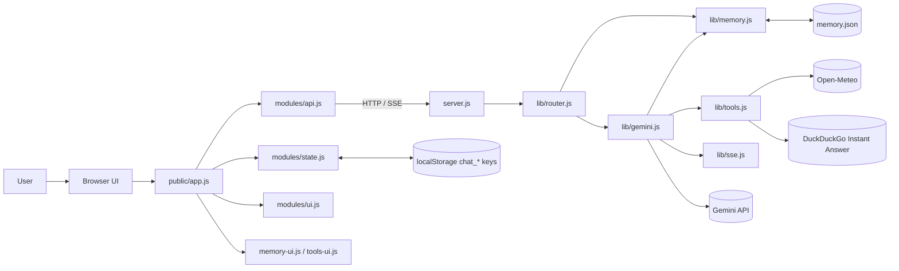

# My Own ChatGPT v2

## One-Page Intro

This project is a local-first Gemini chat client built for the HW02 specification. The browser handles chat sessions, rendering, export, editing/regeneration, image previews, and voice input. The Node.js backend stays zero-dependency and acts as a thin HTTP layer over Gemini, memory persistence, model routing, and tool execution.

The design goal is to keep the system easy to inspect and easy to demo:

- Persistent memory is written to `memory.json` so long-term context survives refreshes.
- Long conversations are compressed into memory bullets before context grows too large.
- Multimodal requests automatically switch to the fast vision-capable Gemini model.
- Auto Route chooses a model based on prompt length, code blocks, image presence, and lightweight task keywords.
- Tool use is implemented with Gemini function calling and three external capabilities: weather, calculator, and web search.
- Frontend state is split into session storage, API transport, and UI rendering modules so later changes stay isolated.

## System Architecture

## Request Flow Summary

1. The browser loads the active `chat_<timestamp>` session from `localStorage`.
2. Before sending a prompt, the frontend fetches persistent memory and appends it to the system prompt.
3. `POST /api/chat` reaches `lib/router.js`, which validates JSON and dispatches to `lib/gemini.js`.
4. `lib/gemini.js` applies image detection, auto routing, optional summarization, and optional function-calling loops.
5. Tool results are streamed back as SSE events (`tool_call`, `tool_result`) alongside model tokens.
6. The frontend updates the timeline, persists the active chat session, and keeps runtime notices in sync.
